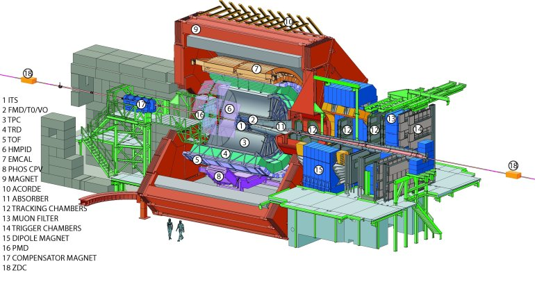

# Introduction 

The study of heavy quarks is one of goals in ultra-relativistic heavy nuclei collisions. Because of their mass, Charm quarks are created in the very early stages of the collision; then, they can interact and allow measures of their properties. In ALICE experiment at CERN, The charmed  Barion Λc+ (udc, mass 2286 MeV/c2) has been reconstructed trough different channels of hadronic decay. One of this is the decay analyzed in this work:  Λc+ → p + Ks . 
One of the main problem in the study of this decay is connected to the extreme short lifetime of the charmed barion: 2*10-13s. The mean path in this short time is of the order of 60 μm that is smaller than the 100 μm resolution of the ALICE micro-vertex system. It is therefore impossible to locate the secondary vertex. This make the selection of the signal in the large amount of background very hard and Multivariate Analysis techniques are then used to classify events.   

 <i><b>ALICE experiment at CERN</i></b>
     
      
 

## TMVA 
The Toolkit for Multivariate Data Analysis is an integrative package of ROOT.. It contains libraries and macros useful for the Multivariate analysis of data specifically designed for high energy physics. In this work the tool was used to compare three methods of multivariate analysis: Linear Cuts, Boosted Decision Trees and Neural Networks. The latest versions of ROOT are perfectly integrated with Python versions > 2.7, so it was possible to use all the ROOT libraries in the [notebook document](https://github.com/gianpierovignola/project/blob/master/01_TMVA_Program.ipynb)
 

| First Header  | Second Header |
| ------------- | ------------- |
| Content Cell  | Content Cell  |
| Content Cell  | Content Cell  |

