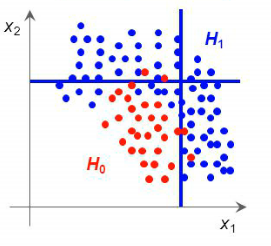
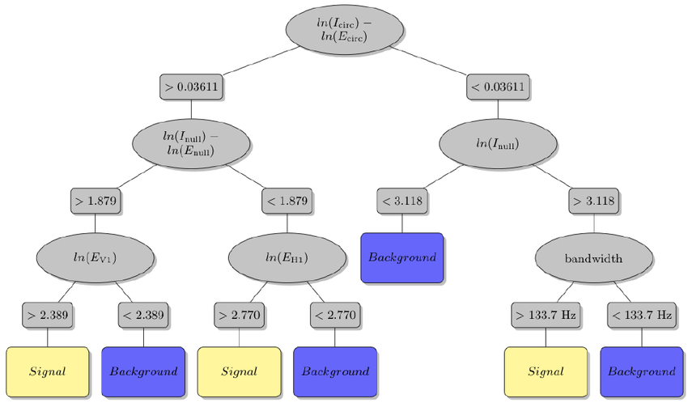
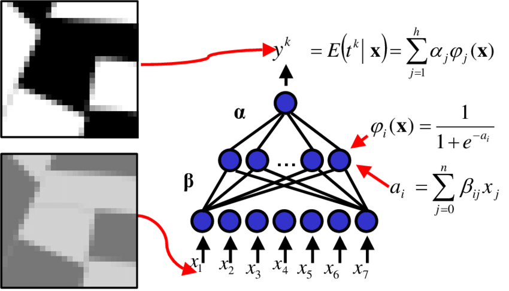

# 1.Introduction 

The study of heavy quarks is one of goals in ultra-relativistic heavy nuclei collisions. Because of their mass, Charm quarks are created in the very early stages of the collision; then, they can interact and allow measures of their properties. In ALICE experiment at CERN, The charmed  Barion Λc+ (udc, mass 2286 MeV/c2) has been reconstructed trough different channels of hadronic decay. One of this is the decay analyzed in this work:  Λc+ → p + Ks .
One of the main problem in the study of this decay is connected to the extreme short lifetime of the charmed barion: 2*10-13s. The mean path in this short time is of the order of 60 μm that is smaller than the 100 μm resolution of the ALICE micro-vertex system. It is therefore impossible to locate the secondary vertex. This make the selection of the signal in the large amount of background very hard and Multivariate Analysis techniques are then used to classify events.   

 <i><b>ALICE experiment at CERN</i></b>
     

# 2.TMVA 
The Toolkit for Multivariate Data Analysis is an integrative package of ROOT.. It contains libraries and macros useful for the Multivariate analysis of data specifically designed for high energy physics. In this work the tool was used to compare three methods of multivariate analysis: Linear Cuts, Boosted Decision Trees and Neural Networks. The latest versions of ROOT are perfectly integrated with Python versions > 2.7, so it was possible to use all the ROOT libraries in the [notebook document](https://github.com/gianpierovignola/project/blob/master/01_TMVA_Program.ipynb). Software versions used (some will be explained below):

| Name of Software  | Version |
| ------------- | ------------- |
| ROOT  | 6.22/03  |
| TMVA  | 4.3.0 |
| JSROOT | 5.8.1 |
| Python | 3.8.2 |
| gcc | 9.3.0 |
| System | Ubuntu 20.04.1 LTS |

## 2.1.Linear Cuts 
Is the simplest method of multivariate analysis. Each event is classified as a type 0 or type 1 by applying linear rectangular cuts to all input variables. The algorithm optimizes the values of the cuts by trying all the possible cuts on training sample. As will be illustrated in the [analysis of results](https://github.com/gianpierovignola/project/blob/master/02_Analysis_Results.md) this method was not very efficient in the analyzed sample (due to the high similarity between the signal and background events).

 <i><b>Linear rectangular cuts on 2 variable</i></b>
 

## 2.2.BDT
A decision tree is a series of binary decisions. Moving through the tree, regions with higher signal or background purity are progressively selected. It is similar to rectangular cuts but with relationship between the consecutive cuts. Generally to obtain an optimal decision tree (not too dependent on the training sample) boosting techniques are used. A "forest" of different trees is created basing on the same training sample, therefore a weighted average of the different trees is obtained trying to optimize the separation between signal and background.

 <i><b>Example of Decision Tree</i></b>
 

## 2.3.Neural Network (MLP)
Neural networks are a method of analysis composed of "neurons" that are activated or not depending on whether a certain threshold is exceeded in the functions that compose them. These functions are added linearly with some weight and the resulting function is passed to the next level. Multilayer Perceptrons (MLPs) are a type of neural networks where there are intermediate levels between input and output layers. In this type of network, loops are prevented.

 <i><b>Example of MLP</i></b>
 
