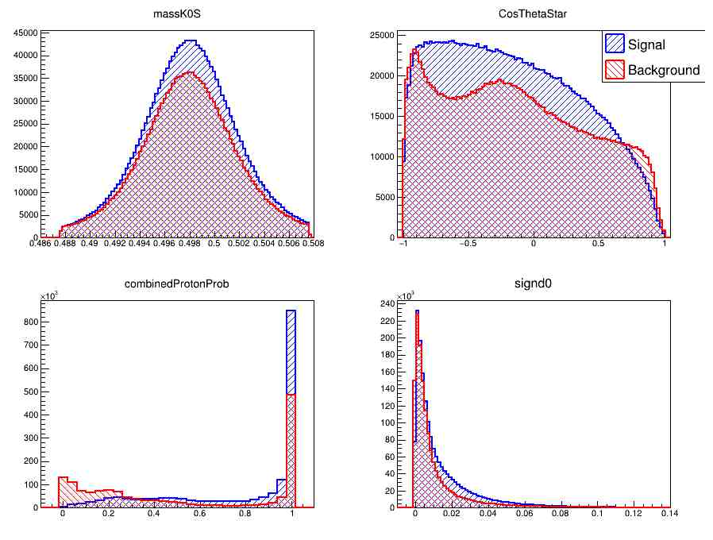
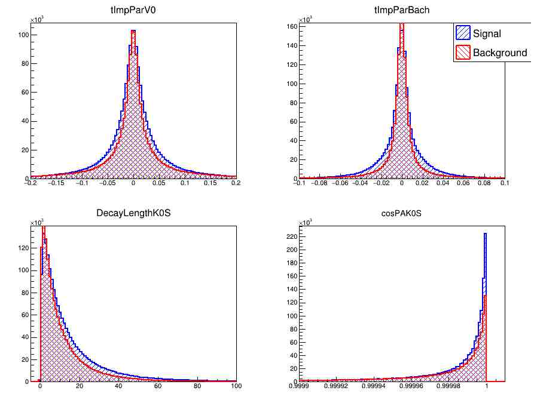
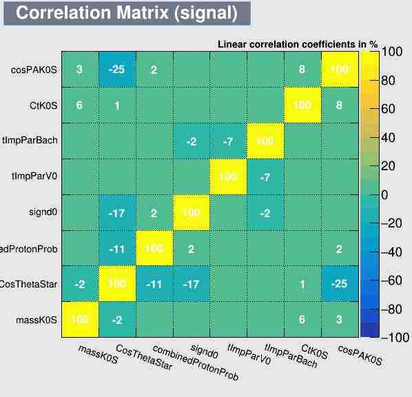
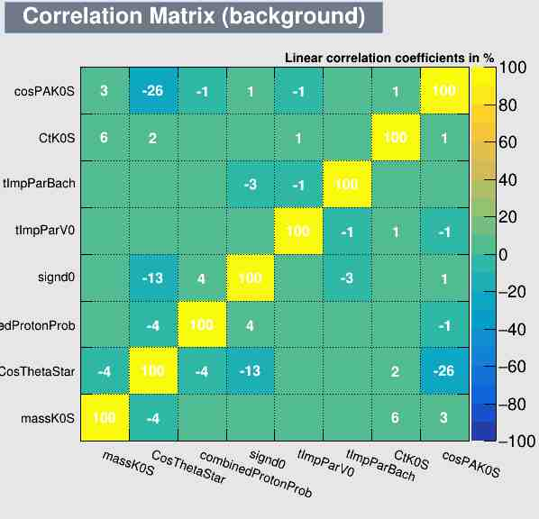
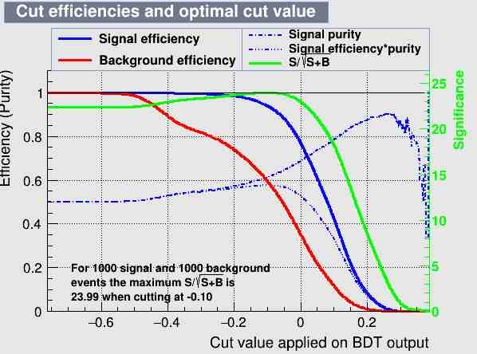
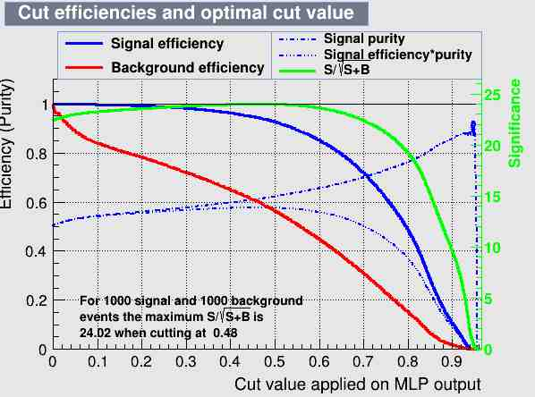
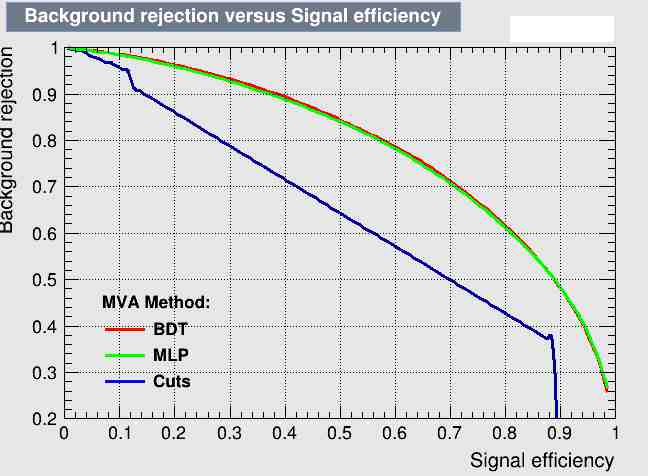
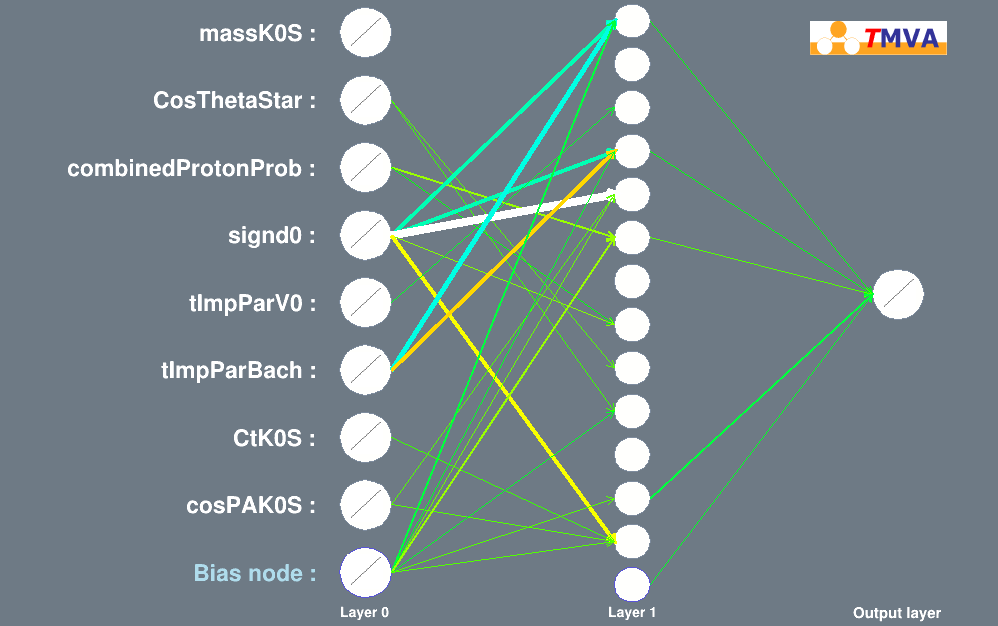
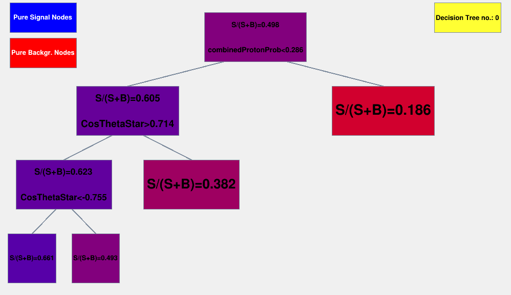

# Analysis Results 

The TMVA class in ROOT contains a function (<i> TMVA::TMVAGui</i>) that allows to call a series of macros that analyze the content of the output producing graphs and histograms relative to the analysis. It is useful to use this plots to analyze the results of the multivariate analysis. In this work it was decided to slightly modify these macros (the relative files are saved [here](https://github.com/gianpierovignola/project/tree/master/JSROOT)). The outputs produced are stored in a server where JSROOT was installed ([Files_on_server](https://github.com/gianpierovignola/project/tree/master/JSROOT/Files_on_server)). By <b>clicking on the images</b> presented here it is possible to access the related display in JSROOT and is possible to use the interactive reading of the results described in the [Introduction](https://github.com/gianpierovignola/project/blob/master/00_Introduction.md).

## 1.Monte Carlo Simulation

Before analyzing the results, it is useful to describe the trees used as a simulation of decay events Λc+ → p+Ks (signal and background). 
The simulation was carried out with the AliRoot(1) framework using the event generator HIJING(2)(Pb-Pb collisions) + PYTHIA(3)(p-p collisions). Using GEANT3(4), the response of the entire ALICE detector was then evaluated and 2 trees of Signal and Backgrouns were generated containing all the available measurements with the detectors. The output file of simulation (AnalysisResults.root) cannot be shared due to size and copyright issues. Thanks to prof. Andrea Alici for making this database available.  
The table summarizes the number of simulated events used for this analysis:

|Description|Number|
|-----------|------|
Total number of Signal events|1762028
Total number of Background events|1473789
total number of Signal events in the selected range (Λc+Pt <6 && Λc+Pt> 4)|499411
total number of Background events in the selected range (Λc+Pt <6 && Λc+Pt> 4)|252957
actual number of Signal events used for the Training|100000
actual number of Background events used for the Training|126478
actual number of Signal events used for the Test|100000
actual number of Background events used for the Test|126478

#### References
1) ALICE Collaboration, AliRoot, ALICE Offline framework for simulation, reconstruction and analysis, [http://alice-offline.web.cern.ch/](http://alice-offline.web.cern.ch/) 
2) X.N Wang and M. Gyulassy, HIJING: a Monte Carlo model for multiple jet production in pp, p-A and A-A collisions, Phys. Rev. D44 (1991) 3501 
3) T. Sjöstrand, S. Mrenna and P.Z. Skands, PYTHIA 6.4 physics and manual, JHEP 05 (2006) 026 [hep-ph / 0603175] 
4) R. Brun et al., GEANT detector description and simulation tool, CERN-W-5013 (1994) 

## 2.Input Variables 

Not all variables contained in the <b>AnalysisResults.root</b> input file were used for the multivariate analysis. It was decided to limit the number of variables to 8 and to add various spectator variables for any future analysis on the output file produced (see paragraph 2. in [TMVA_Program](https://github.com/gianpierovignola/project/blob/master/01_TMVA_Program.ipynb)). 
Below a brief description of the variables that it was decided to use in the multivariate analysis:

* <b> massK0S </b>: Invariant mass of the Ks0 particle decaying into π + and π -. From the momentum of the two daughter particles it is possible to calculate the mass of the parent particle. 

* <b>CosThetaStar</b>: cosine of the angle between the direction of emission of the proton (in the reference system in which Λc+ is at rest) and the direction of Λc+ in the LAB system.   
* <b>combinedProtonProb</b>: Probability that the charged trace associated with Ks0 is a proton.   
* <b>signd0</b>: Proton impact parameter that takes into account the sign. 
* <b>tImpParV0</b>: Impact parameter of Ks0 
* <b>tImpParBach</b>: Proton impact parameter defined as the distance between the reconstructed trace and the primary vertex (small for Signal events)   
* <b>CtK0S</b>: (DecayLengthK0S * 0.497 / v0P) life-time of the Ks0, corresponds to the distance traveled by the Ks0 multiplied by its mass and divided by its momentum.   
* <b>cosPAK0S</b>: cosine of the pointing angle: angle between the reconstructed trace of the Ks0 and the line passing through the primary vertex and point of decay of the Ks0 (close to 1).   

The comparison between signal and background of the input variables is represented in the following graphs (<b>click on it to open the view in JSROOT</b>). The two canvases were obtained using the pyROOT macro: [macro.py](https://github.com/gianpierovignola/project/blob/master/JSROOT/macro.py).
  
<table cellspacing="0" cellpadding="0" width="70%">
<tr><td>
    
</td><td>
    
</td></tr>
</table>

## 3.Correlation Coefficents
In a good set of variables, there must be as little correlation as possible. Adding a correlated variable increases the complexity of the multivariate analysis without increasing the accuracy of the results. Using the ROOT macro [correlations.cxx](https://github.com/gianpierovignola/project/blob/master/JSROOT/correlations.cxx) it was possible to produce the following correlation plots (<b> click on it to open the JSROOT view </b>):
  
<table cellspacing="0" cellpadding="0" width="70%">
<tr><td>
    
</td><td>
    
</td></tr>
</table>
  

## 4.Classifier Output
The three methods tested led to good results only for BDT and MLP. The method of rectangular cuts proved to be particularly inefficient. This is due to the fact that the difference between signal and background in the input variables is very small. Under these conditions only the most complex methods are able to give satisfactory results.  
After TMVA Training and Testing the BDT and MLP classifiers produce a "response function" for signal and Background. The goal is to obtain functions as separate as possible in order to be able to separate the signal and the Background events. The following figures are obtained using the [mvas.cxx](https://github.com/gianpierovignola/project/blob/master/JSROOT/mvas.cxx) macro which uses the [weights](https://github.com/gianpierovignola/project/tree/master/Results/dataset/weights) produced by TMVA. To evaluate the possible presence of overtraining, the functions obtained in Training and Testing were superimposed, the perfect correspondence between the two confirms the absence of overtraining (<b> click on images to open the JSROOT view </b>).
  
<table cellspacing="0" cellpadding="0" width="70%">
<tr><td>
    
</td><td>
    
</td></tr>
</table>
  

## 5.Cuts
Depending on the cut used in the response function domain, the efficiencies of Signal and Background changes. In the following graphs, created with the macro [mvaeff.cxx](https://github.com/gianpierovignola/project/blob/master/JSROOT/mvaeffs.cxx), it is possible to visualize the values of the efficiencies obtained. significance is also indicated, a parameter that we try to maximize in the analysis. It is defined as <b><i>S/sqrt(S+B)</i></b> where S and B are number of Signal and Background events. The maximum of significance represents the optimal cut value.(<b> click on images to open the JSROOT view </b>).
  
<table cellspacing="0" cellpadding="0" >
<tr><td>
    
</td><td>
    
</td></tr>
</table>
  

## 6.ROC Curves 

One of the best ways to compare the efficiency of multivariate analysis methods is to look at the Receiver-Operating-Characteristic (ROC) curves. These represent the relationship between signal efficiency and background rejection. In an optimal situation one would like to reject all the Background maintaining the maximum signal efficiency. The working point on a curved ROC is chosen according to the analysis needs. For example, in the trigger selection high signal efficency is required while for precision measurements a high reduction of the background is preferred.  
As it is possible to see from the ROC curve (realized with the macro [efficiencies.cxx](https://github.com/gianpierovignola/project/blob/master/JSROOT/efficiencies.cxx)) the BDT and MLP methods have almost identical performances (more quantitative details in the file [std_output.txt](https://github.com/gianpierovignola/project/blob/master/Results/std_output.txt)). The Linear Cuts method, on the other hand, is totally unsuitable. it is almost comparable to a random assignment of the data type.(<b> click on images to open the JSROOT view </b>).

## 7.Graphical Representation of BDT and MLP
Using the macros [network.cxx](https://github.com/gianpierovignola/project/blob/master/JSROOT/network.cxx) and [BDT.cxx](https://github.com/gianpierovignola/project/blob/master/JSROOT/BDT.cxx) it is possible to draw the structure of the realized Neural Network (with a graphic representation of the weights given to the variables and connection between neurons) and the realized BDTs (subsequently averaged with boosting). an example below:
  

  

  
